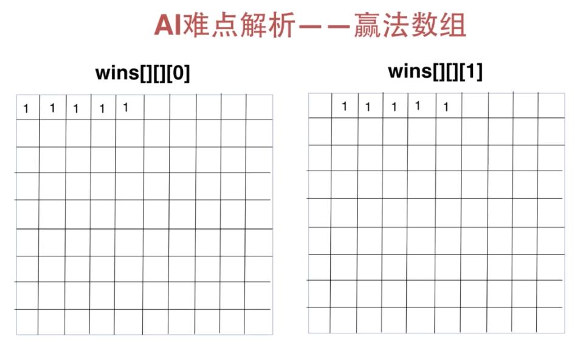
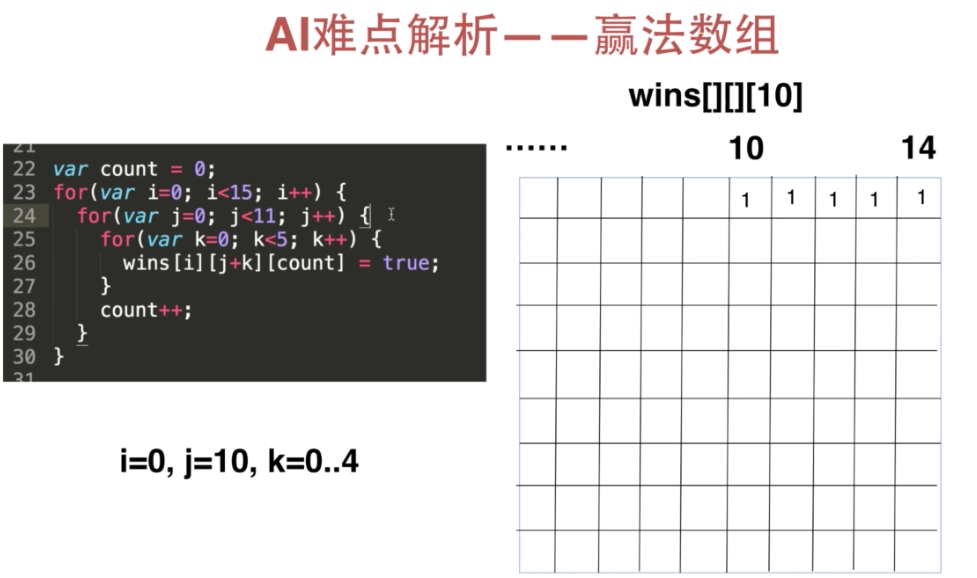
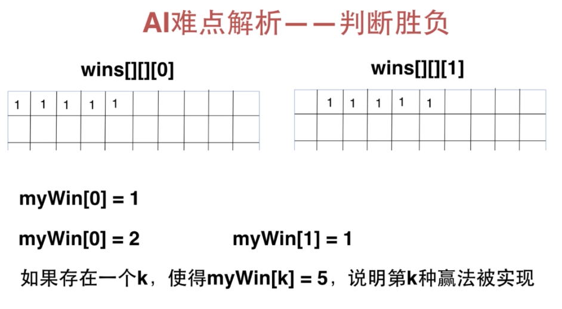

## UI篇

### 棋盘的画法
- canvas绘制直线

```javascript
context.moveTo();
context.lineTo();
context.stroke();
```

- 设置画笔颜色

```javascript
context.strokeStyle
```

### 棋子的画法
- canvas画圆

```javascript
context.arc()
```

- 填充渐变色

```javascript
var gradient = context.createRadialGradient(x1,y1,r,x2,y2,r2);
gradient.addColorStop(0, '#0a0a0a');
gradient.addColorStop(1, '#636766');
```

### 五子棋交互逻辑处理

************************

## AI篇

AI难点解析
- 赢法数组： 记录五子棋所有赢法，三维数组




- 每一种赢法的统计数组，一维数组



- 如何判断胜负
- 计算机落子规则

### 五子棋AI的运行原理

### 五子棋AI使用到的数据结构

### 编程实现五子棋AI